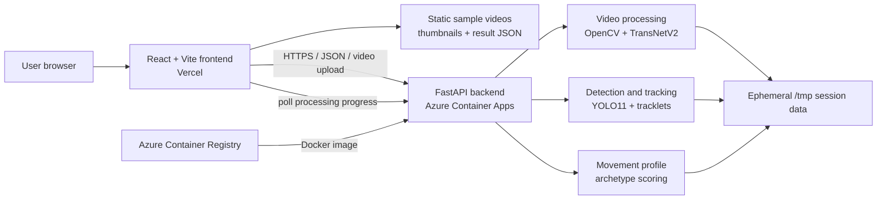

# Footee Vision: Project Overview

## Project status

Footee Vision is a live, experimental soccer computer-vision application. It
turns an uploaded player reel into scene-based clips, lets the user identify and
track a player, and creates a first-stage player profile from observed movement.
The product is designed as a development and film-study aid rather than a final
scouting verdict.

| Resource | Location |
| --- | --- |
| Live web app | [footee-highlights.vercel.app](https://footee-highlights.vercel.app/) |
| Backend health check | [Azure API health](https://footee-vision-api.mangoplant-7b9bb2f4.eastus.azurecontainerapps.io/health) |
| API documentation | [FastAPI Swagger UI](https://footee-vision-api.mangoplant-7b9bb2f4.eastus.azurecontainerapps.io/docs) |
| Frontend hosting | Vercel |
| Backend hosting | Azure Container Apps |
| Container registry | Azure Container Registry |

The current application version is an early public preview. Its interface
explicitly warns users that clipping, tracking, and analysis are still being
improved.

## Product goal

Player reels are useful for recruiting and self-review, but watching and
organizing them manually takes time. Footee Vision explores how computer vision
can help a player or coach move from a long reel to structured film review:

- separate a reel into individual plays;
- remove likely intros, graphics, and non-gameplay cutaways;
- let a human confirm which player matters instead of guessing identity;
- follow that player through each selected clip;
- summarize observable movement into understandable traits and an archetype;
- recommend comparable players whose film may be useful to study.

Human input remains important. The user selects the target player, can add an
identity anchor where tracking becomes uncertain, and provides position and
footedness before profile generation.

## User journey

### Instant sample library

Visitors who do not have a highlight reel ready can open one of three bundled
examples: Alistair Johnston, Jack Harrison, or Ousseni Bouda. Each
reel was split and classified once on the local development machine. Vercel
serves the resulting video, thumbnails, and JSON directly, so opening or
scrubbing a sample does not wake Azure Container Apps or run TransNetV2, YOLO,
tracking, or profile inference.

The sample view is intentionally read-only. It demonstrates scene splitting,
cutaway organization, metadata, clip navigation, playback, and scrubbing. A
user uploads their own reel when they want live player detection, tracking, and
profile generation. The three static sample packages remain below Vercel's
Hobby static-upload limit; this
avoids backend compute but still uses ordinary frontend/CDN bandwidth.

### 1. Upload a reel

The browser accepts a supported video and uploads it to a randomly generated
session ID. The interface explains that the free, scale-to-zero backend may need
time to wake before the upload begins. The file is stored only for the active
analysis session and is subject to automatic expiry.

Supported extensions are MP4, MOV, AVI, MKV, and WebM. The default upload limit
is 500 MB.

### 2. Split and classify the reel

Starting processing returns immediately with HTTP `202 Accepted`. The backend
runs the long job outside the request lifecycle, and the frontend polls a
progress endpoint. This avoids keeping one upload request open beyond Azure
Container Apps' ingress timeout.

The progress interface reports three distinct stages and marks each one complete
visually:

1. **Scene cuts (TransNetV2)** — scans the video and finds shot boundaries.
2. **Cutaway filtering** — labels likely gameplay and non-gameplay segments.
3. **Thumbnails** — generates a visual reference for each retained segment.

Progress includes the current frame count and an overall percentage, so a user
can see that a long reel is still moving through the pipeline.

### 3. Review clips and select the player

Gameplay segments are shown as individual review cards, while skipped cutaways
are separated from the usable clips. Inside a clip, the user can:

- scrub to a clear frame;
- run object detection on that frame;
- inspect detected player boxes and inferred team-color grouping;
- select the player who should be tracked;
- clear an incorrect selection and start again.

This explicit selection step reduces the ambiguity of trying to infer the target
player from the entire reel automatically.

### 4. Track and recover identity

The selected player is tracked across the clip. The UI distinguishes tracked,
recovered, interpolated, searching, and ended states instead of presenting every
box as equally certain. If tracking loses the player, the user can click the same
player later in the clip to add another anchor. The backend then uses those
anchors while stitching the identity through the sequence.

### 5. Generate a player profile

After tracking enough clips, the user selects one or more positions and chooses
left-, right-, or both-footed. Supported position inputs are striker, left wing,
right wing, central midfield, defensive midfield, number 10, center-back,
right-back, and left-back.

The profile uses tracked movement to produce:

- clip-level movement features;
- readable traits and supporting evidence;
- candidate archetype scores;
- a primary role archetype and confidence;
- film-study recommendations matched to archetype and footedness.

The recommendation list is deduplicated before display. Current midfield and
forward recommendation groups include holding midfielder, deep-lying
playmaker, box-to-box midfielder, attacking playmaker, target man, poacher,
inside forward, classic winger, and false nine. Defensive profiles can also
resolve to ball-playing defender, stopper, or wing-back, although the curated
similar-player film list currently focuses on the midfield and forward groups.

## Current capabilities

### Video processing

- three preprocessed, read-only sample reels that require no backend request;
- private random IDs for upload sessions;
- metadata extraction with OpenCV;
- asynchronous processing and pollable progress;
- TransNetV2 scene-boundary detection;
- bounded, streaming frame windows instead of loading the full reel into RAM;
- optional hybrid color, edge, object-layout, and camera-registration fallback;
- segment-start trimming to reduce transition residue;
- gameplay-versus-cutaway classification;
- thumbnail creation and segment playback.

### Detection and tracking

- YOLO11-based player and ball detection;
- optional football-specific detector checkpoints;
- inferred team grouping from upper-torso jersey color;
- user-confirmed target selection;
- cached, batched detections for tracking;
- camera-motion compensation;
- tracklet creation and full-clip stitching;
- position, overlap, size, jersey-color, and appearance identity signals;
- conservative handling of ambiguous crossings and implausible jumps;
- short-gap interpolation and recovery of suitable orphan detections;
- manual multi-anchor recovery when automation is insufficient;
- optional OSNet neural re-identification, with a color descriptor fallback when
  its checkpoint is unavailable.

### Analysis and film study

- position-aware archetype candidates;
- movement measures normalized by observed player height, avoiding a false claim
  of calibrated meters when pitch calibration is unavailable;
- clip evidence, trait summaries, scores, and confidence;
- footedness-aware similar-player suggestions;
- duplicate recommendation removal.

Ball-event code exists behind a feature flag, but it is disabled in production.
Small, fast-moving balls are not detected consistently enough in typical reel
footage to report reliable touches, passes, or shots. The live product therefore
limits its analysis to the signals it can currently support: player movement and
relative positioning.

## System architecture



The frontend and backend are deployed separately because Vercel is a good fit
for the static React client but not for long-running CPU-heavy video inference.
Azure Container Apps supplies more memory and CPU, runs the Docker image, and
can scale the backend to zero when it is idle.

### Frontend

The frontend is a React 19 single-page application written in TypeScript and
styled with Tailwind CSS. Important modules include:

| Module | Responsibility |
| --- | --- |
| `App.tsx` | Coordinates the upload, processing, results, and profile workflow |
| `api/client.ts` | Centralizes calls to the configured backend |
| `VideoUploader.tsx` | Upload selection, validation, and wake-up messaging |
| `ProcessingPanel.tsx` | Live stage, frame, percentage, and completion feedback |
| `ResultsView.tsx` | Separates usable gameplay clips from skipped material |
| `SegmentCard.tsx` | Clip review, detection, player selection, tracking, and recovery |
| `PlayerProfilePanel.tsx` | Player details, evidence, archetype scores, and profile output |
| `SimilarPlayers.tsx` | Displays the film-study recommendation list |
| `DisclaimerModal.tsx` | Presents the limitations before a user begins |

`VITE_API_BASE_URL` is compiled into the Vite application at build time. In
production it points to the Azure Container Apps HTTPS endpoint; in local
development it defaults to `http://localhost:8000`.

The instant-demo catalog loads `frontend/public/samples/<sample-id>/result.json`
and uses the accompanying MP4 and thumbnails directly. Demo IDs are never sent
to the backend, page-exit cleanup is not registered for them, and controls that
would invoke detection or tracking are hidden.

### Backend

The backend is a FastAPI application running under Uvicorn with one worker. Its
service layer separates storage, processing, model loading, detection, camera
motion, appearance descriptors, team color, tracklets, player tracking, and
profile construction. Models are loaded through a registry so the large neural
objects can be released between memory-intensive pipeline stages.

The production image uses Python 3.12 and CPU-only PyTorch. FFmpeg and headless
OpenCV provide video support without a desktop environment.

## Processing pipeline

### Scene detection

TransNetV2 is the primary shot-boundary detector. Frames are resized and passed
through bounded windows, preventing memory use from growing with the total frame
count. The production window is 50 frames. The counter can advance for reels of
different lengths without retaining every decoded frame, although total runtime
and ephemeral disk use still grow with video length.

The fallback scene detector combines spatial HSV histograms, edge structure, and
optional object-layout changes. A higher-quality local configuration can also
run a second visual pass and camera-registration checks for similar-looking cuts.
Low-memory production settings disable selected secondary work to keep inference
within the deployed resource envelope.

### Cutaway filtering and thumbnails

Each candidate segment is sampled and classified using visual pitch coverage and
player evidence. Likely intros, title cards, close-ups, and other cutaways remain
visible as skipped items rather than silently disappearing. A representative
JPEG thumbnail is created for each segment.

### Player detection

The live deployment uses the small YOLO11n checkpoint to control CPU and memory
cost. When a reviewed football-specific checkpoint is present, the pipeline can
use native player, goalkeeper, referee, and ball classes. Otherwise the generic
model maps person and sports-ball classes into the application's vocabulary.

### Player tracking

The default engine creates a bounded detection cache, forms short tracklets, and
stitches them using full-clip context. Identity decisions combine camera-
compensated position, appearance, team color, size, and overlap. Strict gates
reject unrealistic player speed and uncertain cross-team links. Ambiguous gaps
remain visible as a searching state instead of forcing a potentially incorrect
identity.

Tracking samples frames according to a configurable stride and interpolates only
short, spatially believable gaps. The production deployment batches four
detection frames at a time and uses a 512-pixel inference size through
low-memory defaults.

### Profile construction

Tracked boxes are converted into relative movement features, including work
rate, speed changes, horizontal width, vertical positioning, and involvement
patterns available from the selected clips. Position choices narrow the
candidate archetypes. Scores are accompanied by evidence and confidence so the
result is inspectable rather than presented as an unexplained label.

The output is intentionally described as a first-stage movement profile. It does
not yet understand the complete tactical situation, reliably identify every
on-ball event, evaluate decision quality, or replace a coach's film review.

## API overview

All video endpoints use the `/api/videos` prefix.

| Method and route | Purpose |
| --- | --- |
| `POST /upload` | Save a temporary upload and return its random video ID |
| `POST /{video_id}/process` | Start asynchronous reel processing; returns `202` |
| `GET /{video_id}/processing-progress` | Return stage, frame counts, percentage, and job status |
| `GET /{video_id}/result` | Fetch the completed analysis JSON |
| `GET /{video_id}/video` | Stream the temporary source video for clip review |
| `GET /{video_id}/thumbnail/{segment_id}` | Return a segment thumbnail |
| `POST /{video_id}/segment/{segment_id}/detect-frame` | Detect selectable objects at a timestamp |
| `POST /{video_id}/segment/{segment_id}/detect` | Create a detection summary for a clip window |
| `POST /{video_id}/segment/{segment_id}/focused-player` | Save a player selection or additional anchor |
| `DELETE /{video_id}/segment/{segment_id}/focused-player` | Clear the selection and track |
| `POST /{video_id}/segment/{segment_id}/track-focused-player` | Track the selected player and return clip features |
| `POST /{video_id}/player-info` | Save positions and footedness |
| `POST /{video_id}/player-profile` | Build the movement profile |
| `DELETE /{video_id}` | Delete the full temporary session |
| `POST /{video_id}/cleanup` | Beacon-friendly session cleanup during page exit |

The service also exposes `GET /`, `GET /health`, `HEAD /health`, and `/docs`.

## Temporary data and privacy

Footee Vision does not intentionally provide persistent user video storage.
During a session, the backend may create:

- the raw uploaded video;
- thumbnails and temporary segment artifacts;
- detection caches and focused-player tracks;
- a JSON processing result.

These artifacts share the same random session ID. Starting a new upload or
leaving the page triggers a browser cleanup request. The backend also purges
abandoned sessions after one hour by default and scans every 15 minutes, covering
cases where a browser closes before its cleanup request arrives.

Production stores this data under `/tmp/footee-vision`, which is ephemeral. A
container restart can remove an in-progress or completed session. There is no
user account, long-term media library, or durable database in the current
version. Transport between the live frontend and backend uses HTTPS, and CORS is
restricted to the configured frontend origin.

Temporary storage reduces retention risk, but it does not mean the video is
never stored: the backend must hold it briefly to process and serve the active
session.

The three bundled demo reels have a different lifecycle. They are deliberately
public, persistent frontend assets committed with the application and are not
covered by session cleanup. They must only be deployed when the project owner
has permission to redistribute the footage.

## Production deployment

### Frontend: Vercel

Vercel builds the `frontend` Vite project from GitHub. Its production environment
contains:

```dotenv
VITE_API_BASE_URL=https://footee-vision-api.mangoplant-7b9bb2f4.eastus.azurecontainerapps.io
```

Because Vite substitutes this value during the build, changing it requires a new
Vercel deployment.

Vercel also hosts the preprocessed sample MP4 files, thumbnails, and JSON. This
keeps sample use away from the Azure API and prevents demo traffic from spending
inference CPU. It does not eliminate static bandwidth or repository/deployment
size, so sample asset usage should still be monitored.

### Backend: Azure Container Apps

`deploy-azure.ps1` creates or updates the following Azure resources:

- resource group `footee-vision-rg`;
- a Basic Azure Container Registry;
- Container Apps environment `footee-vision-env`;
- external Container App `footee-vision-api`.

The current Container App configuration is:

| Setting | Production value |
| --- | --- |
| CPU | 2 vCPU |
| Memory | 4 GiB |
| Minimum replicas | 0 |
| Maximum replicas | 1 |
| HTTP concurrency target | 1 |
| Uvicorn workers | 1 |
| Temporary storage | `/tmp/footee-vision` |
| Model device | CPU |

Scaling to zero limits idle compute usage but introduces a cold start. The first
visitor after an idle period may wait while Azure starts the container and loads
the application. Azure Container Registry remains provisioned even when the app
has zero active replicas.

The Azure for Students subscription can block cloud-based ACR Tasks. The deploy
script therefore builds the Linux image with local Docker, authenticates to the
registry, pushes a unique image tag, and updates the Container App revision.

Deploy from the repository root after starting Docker Desktop and signing in to
the intended Azure subscription:

```powershell
az login
az account show --query "{subscription:name,id:id}" --output table
.\deploy-azure.ps1
```

To remove the entire Azure deployment:

```powershell
az group delete --name footee-vision-rg --yes --no-wait
```

## Important configuration

Every backend setting is environment-overridable in
`backend/app/core/config.py`. The most relevant production controls are:

| Variable | Current deployment value | Purpose |
| --- | --- | --- |
| `CORS_ORIGINS` | Live Vercel origin | Restricts browser API access |
| `FOOTEE_STORAGE_DIR` | `/tmp/footee-vision` | Keeps session artifacts in ephemeral storage |
| `LOW_MEMORY_MODE` | `true` | Selects bounded processing defaults |
| `SCENE_DETECTION_METHOD` | `transnetv2` | Chooses the primary cut detector |
| `TRANSNETV2_WINDOW_SIZE` | `50` | Bounds scene-detector activation memory |
| `TRANSNETV2_CPU_THREADS` | `2` | Limits scene-detector CPU parallelism |
| `YOLO_MODEL_PATH` | `yolo11n.pt` | Uses the compact detector |
| `TRACKING_MODEL_PATH` | `yolo11n.pt` | Uses the compact tracking detector |
| `TRACKING_BATCH_SIZE` | `4` | Bounds simultaneous tracking inference |
| `MAX_UPLOAD_SIZE_MB` | `500` | Caps incoming file size |
| `UPLOAD_RETENTION_SECONDS` | `3600` | Expires abandoned sessions after one hour |
| `BALL_EVENTS_ENABLED` | `false` by application default | Hides unreliable ball-event estimates |

The deployment also caps OpenMP, MKL, and OpenBLAS thread counts and sets
`MALLOC_ARENA_MAX=2` to reduce memory fragmentation and excess allocator arenas.

## Local development

Requirements:

- Python 3.12 recommended;
- Node.js and npm;
- FFmpeg support available to OpenCV;
- Docker Desktop and Azure CLI only when deploying.

Start the backend:

```powershell
cd backend
python -m venv .venv
.\.venv\Scripts\Activate.ps1
pip install -r requirements.txt
uvicorn app.main:app --reload
```

Start the frontend in another terminal:

```powershell
cd frontend
npm install
npm run dev
```

Then open `http://localhost:5173`. FastAPI documentation is available at
`http://localhost:8000/docs`.

Useful validation commands are:

```powershell
cd frontend
npm run lint
npm run build

cd ..\backend
.\.venv\Scripts\python.exe -m pytest
```

If no test suite is installed in the environment, at minimum validate the
frontend build, import the FastAPI application, and exercise `/health`, upload,
processing, result retrieval, and cleanup with a small test video.

## Memory and performance design

The initial 512 MB hosting target was too small for PyTorch, TransNetV2, OpenCV,
YOLO, decoded frames, and tracking state to coexist reliably. The current Azure
deployment uses 4 GiB and still applies bounded-memory controls:

- stream TransNetV2 windows rather than collecting the full video;
- explicitly release the scene model before later neural stages;
- use YOLO11n for production inference;
- retain one Uvicorn worker and one Container App replica;
- cap inference batches and numerical-library thread counts;
- skip expensive secondary classifiers under low-memory mode;
- keep tracking caches and appearance samples bounded.

These choices make memory usage depend mainly on the active inference window,
not on the total number of frames. A longer reel can still take proportionally
longer to decode and process, consume more temporary disk, or be interrupted by
platform limits. The application should therefore avoid promising literally
unlimited input length.

## Known limitations

- Scene boundaries can be early, late, incomplete, or missed, particularly for
  dissolves and visually similar clips from the same camera angle.
- Cutaway filtering is heuristic and can misclassify close-ups or unusual field
  views.
- Player detection quality decreases when athletes are tiny, blurred, occluded,
  or outside the detector's training distribution.
- Tracking can lose the selected player, switch identity, or require a manual
  anchor during crossings, whip pans, zooms, and long occlusions.
- The first request after an idle period can be delayed by Azure scale-to-zero.
- Processing is CPU-only in the current student-budget deployment and can take
  several minutes for a long reel.
- Player profiles use relative frame-by-frame movement, not complete match
  context, verified physical distance, decision quality, or reliable ball events.
- Session files are temporary; a container restart can end an active analysis.
- Similar-player suggestions are curated film-study examples, not statistical
  proof that two players have equal ability or style.

The disclaimer shown in the app asks users to treat all results as an early
development aid rather than a definitive scouting or performance assessment.

## Roadmap

The most valuable next improvements are:

1. evaluate scene boundaries and cutaway labels against a reviewed reel dataset;
2. fine-tune and validate a football detector on diverse camera angles;
3. measure identity switches and recovery accuracy on labeled tracking clips;
4. add clearer per-stage time estimates and cancellation controls;
5. calibrate movement against pitch geometry when field lines are reliable;
6. re-enable on-ball features only after ball-event accuracy is measured;
7. add optional authenticated storage only with explicit consent and retention
   controls;
8. add automated backend tests and production observability for processing time,
   memory, failure stage, and cleanup success.

## Repository map

```text
footee-highlights/
├── frontend/
│   ├── public/samples/           Static sample videos, thumbnails, and results
│   └── src/
│       ├── api/                 Backend client
│       ├── components/          Upload, processing, clips, tracking, profile UI
│       ├── data/                Demo catalog and similar-player recommendations
│       ├── types/               Shared frontend analysis types
│       └── utils/               Shared clip formatting helpers
├── backend/
│   ├── app/
│   │   ├── core/                Environment-driven configuration
│   │   ├── models/              FastAPI/Pydantic schemas
│   │   ├── routes/              Video workflow endpoints
│   │   └── services/            Vision, tracking, storage, and analysis pipeline
│   ├── models/                  Optional local football and ReID checkpoints
│   ├── scripts/                 Dataset, model, and demo tooling
│   │   └── build_demo_samples.py  Rebuilds static samples locally
│   └── storage/                 Local temporary development artifacts
├── Dockerfile                   CPU production backend image
├── deploy-azure.ps1             Azure build and deployment automation
├── README.md                    Concise setup and project introduction
└── project_overview.md          This detailed project reference
```

## Current validation status

The live Azure health endpoint responds successfully, the Vercel build is wired
to the Azure API, and an end-to-end production smoke test has completed the full
temporary lifecycle: upload, asynchronous scene processing, result retrieval,
and deletion of the raw upload and derived artifacts. This confirms the deployed
components can communicate; it does not replace accuracy evaluation on a broad,
reviewed football dataset.

The three demo packages have also been validated locally: each result JSON points
to an existing video and thumbnail set, representative thumbnails decode
successfully, and the sample library is included in the production Vite build.
